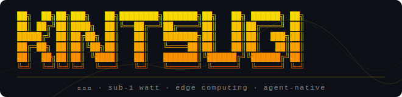

<div align="center">
  
</div>

> *Kintsugi (金継ぎ) — the Japanese art of repairing broken pottery with gold, making the fractures part of the beauty.*

An operating system for sub-1 watt computers. Kintsugi OS takes the proven BeOS/Haiku kernel and kit architecture and reshapes it for the edge — stripping weight, adding intelligence, and targeting the milliwatt-class hardware that modern software has left behind.

---

## What is Kintsugi OS?

Kintsugi OS is a hard fork of [Haiku OS](https://www.haiku-os.org), rebuilt for a different era of computing. Where Haiku targets the desktop, Kintsugi targets the edge — small, low-power devices that interact with the physical world.

---

## Target Platform

Kintsugi OS is designed for **low-power edge devices** in the sub-1 watt to low-watt range, with a focus on:

- **Embedded and IoT interaction** — devices that sense, actuate, and communicate with the physical world
- **Machine learning at the edge** — on-device inference without cloud dependency
- **Agent-native computing** — local AI agents running directly on hardware

### Current Reference Hardware

**Intel N100-based platforms** are the primary development target — efficient x86_64 cores with enough headroom for real workloads at a fraction of desktop power draw.

| Board | Link |
|---|---|
| LattePanda Mu V1.0 | [lattepanda.com/lattepanda-mu](https://www.lattepanda.com/lattepanda-mu) |

---

## Building

Kintsugi OS uses the Haiku build system (Jam-based). See the [Haiku build documentation](https://www.haiku-os.org/guides/building) for toolchain setup, then:

```sh
./configure --build-cross-tools x86_64 ../buildtools
cd generated.x86_64
jam -q @image
```

To run in QEMU with KVM:

```sh
./run.sh
```

---

## License

New contributions are licensed under **Apache 2.0**. Portions derived from Haiku OS are used under the **MIT License**. See `License.md` for the full Haiku/MIT license text.

---

## Acknowledgements

Kintsugi OS is built upon the extraordinary work of the [Haiku project](https://www.haiku-os.org) and its contributors. Haiku is an open-source reimplementation of [BeOS](https://en.wikipedia.org/wiki/BeOS) — a visionary operating system from the late 1990s that was decades ahead of its time in its approach to multimedia, real-time performance, and OS design.

The BeOS lineage brings a clean, responsive, single-user OS model with a fast IPC system, a unified object-oriented API, and a kernel designed for real-time responsiveness. These properties, largely wasted on desktop hardware, are exactly what edge computing needs.

We are deeply grateful to:

- The **Haiku development team** and every contributor who has kept the BeOS vision alive
- The original **Be Inc.** engineers who built BeOS and showed what a personal OS could be

Kintsugi OS would not exist without the foundation they built.
